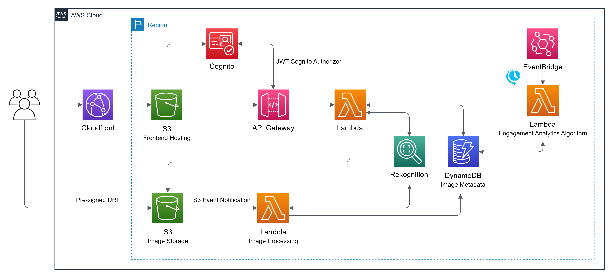

# RekoSearch

RekoSearch is a serverless AI-driven image search and discovery platform.

## Frontend Technologies

The frontend is built with React 18, hosted on AWS S3 and distributed via AWS CloudFront. User authentication is handled by AWS Cognito.

-   TypeScript
-   React 18
-   Vite
-   React Router
-   TailwindCSS
-   HeadlessUI

## Backend (Serverless) Technologies

The backend is built with AWS Serverless technologies, enabling scalable and efficient image processing and search. It leverages AI for image recognition and indexing.

-   TypeScript
-   AWS API Gateway (HTTP APIs)
-   AWS Lambda (Node.js 20.x)
-   AWS DynamoDB (Images & Labels Storage)
-   AWS Cognito (User Authentication)
-   AWS S3 (Image Storage)
-   AWS Rekognition (AI-powered Image Analysis)
-   AWS EventBridge (Scheduled Tasks & Automation)

## AWS Infrastructure

</img>

 

**_Note_**: This project is currently under development, and its structure, technologies, and features are subject to change.
